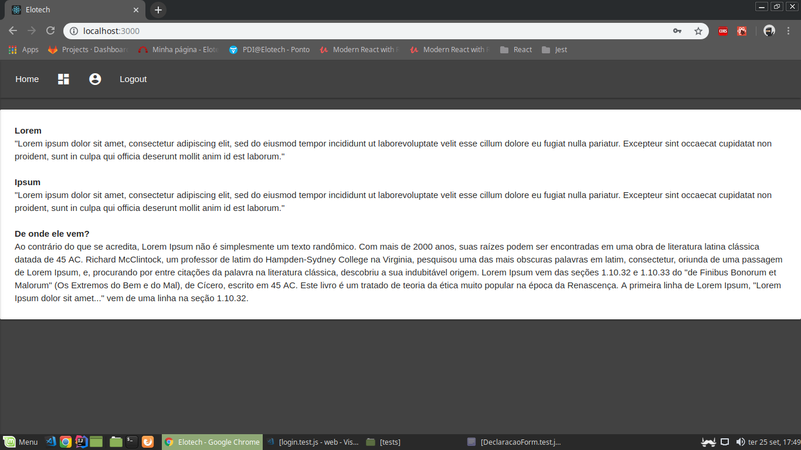
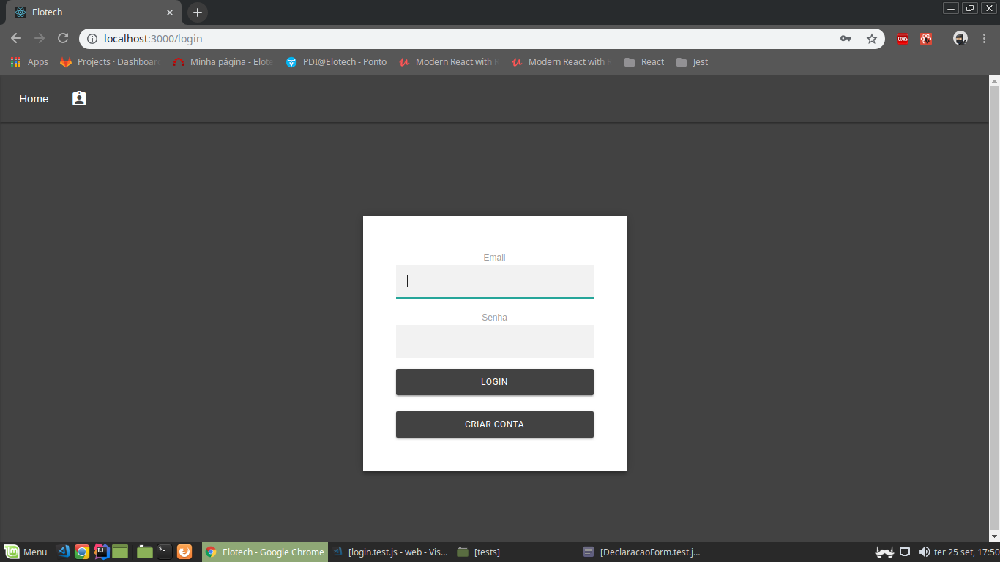
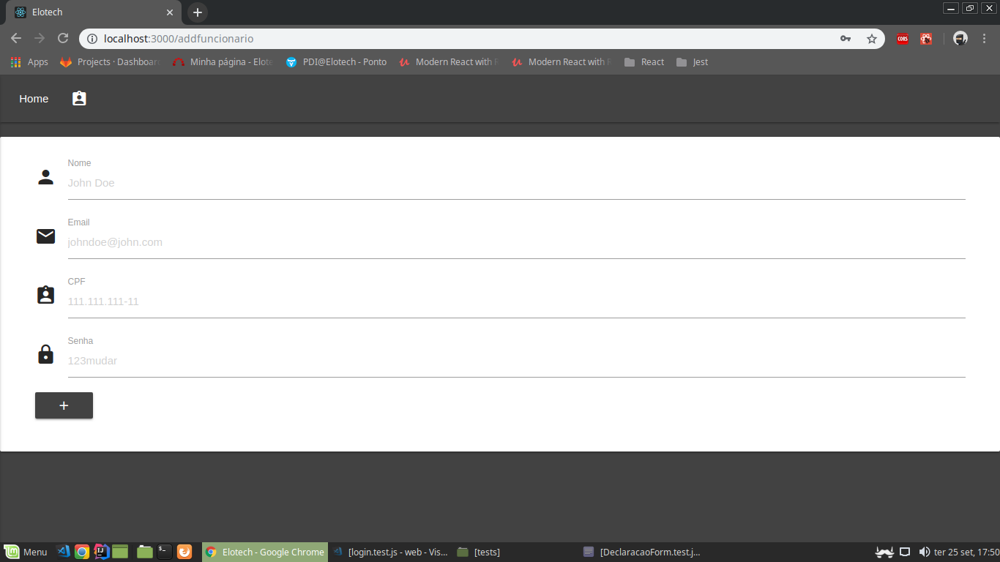
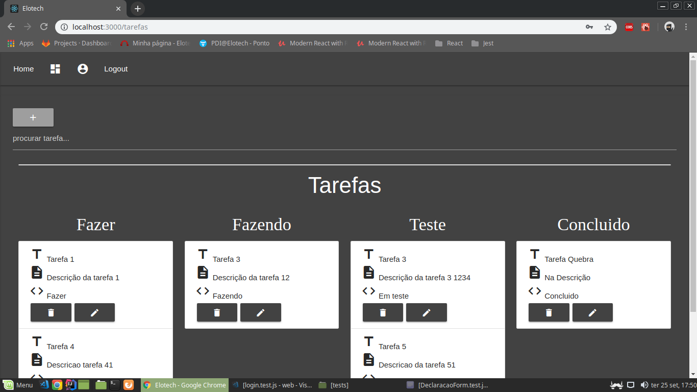

Projeto para aprendizado de ReactJS e Spring Boot
---

Projeto consiste em uma API com backend desenvolvido em Spring Boot e para frontend é utilizado a biblioteca ReactJS.

O projeto é uma aplicação de tarefas na qual o usuário pode estar cadastrando as tarefas que está realizando no momento. Abaixo tem algumas imagens de exemplo do funcionamento do backend.

